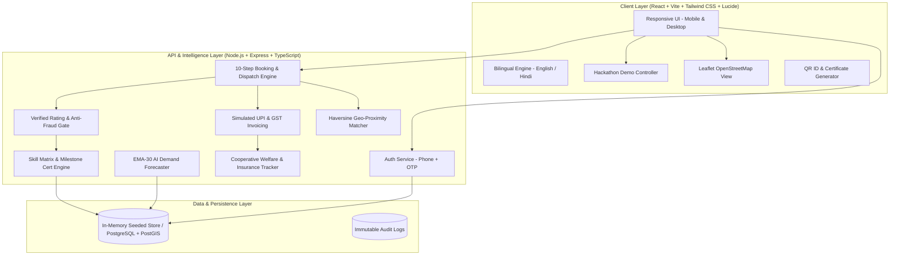

# Sahakar Seva (सहकार सेवा)
### *Verified Workers. Fair Work. Trusted Services.*

> **Smart India Hackathon (SIH) | Problem Statement ID: 26089**  
> **Category:** Cooperative Gig Services Platform for Household & Community Services  
> **Status:** Production-Ready Full Stack Application (React + Vite + TypeScript + Node.js/Express + PostGIS Schema)

---

## 📌 Executive Summary

Traditional gig platforms extract hefty commissions (20–35%), offer zero social security, obscure algorithmic ratings, and treat workers as expendable contractors. **Sahakar Seva** flips the gig economy paradigm into a **cooperative-owned digital marketplace**.

By organizing local gig workers into regulated cooperative primary societies under a state federation, the platform guarantees:
1. **Dignity & Fair Pay:** Direct bank payouts with minimal cooperative retention (2% allocated transparently into worker accident/health welfare funds).
2. **Cooperative Digital Identity & QR Verification:** Tamper-proof, cryptographically signed Digital Worker ID cards with public verification endpoints and PII data redaction.
3. **Transparent Skill Scoring:** Meritocratic skill tiers computed via an open formula ($\text{Jobs} \times \text{Rating} \times \text{On-Time \%}$) with verifiable milestone certificates.
4. **Demand Forecasting & Zonal Optimization:** Time-series demand forecasting with exponential moving averages to prevent oversupply and balance worker distribution across wards/districts.
5. **Anti-Fraud & Audit Trails:** Review velocity detection, geo-anomaly flags, and rating verification gates (ratings strictly locked until service completion and payment confirmation).

---

## 🏗️ System Architecture



---

## 🌟 Core Features & Modules

### 1. 👥 Multi-Role Portals & Interactive Dashboards
- **Customer Portal:** Search nearby verified cooperative workers by trade (Electrician, Plumber, Carpenter, House Cleaner, Appliance Repair, Painter). Book scheduled or emergency services, track live status milestones, pay via simulated UPI/Cards/Cash, and download GST tax invoices.
- **Worker Portal:** Real-time job alert feed with accept/decline actions, step-by-step progress status updater (`ACCEPTED` $\to$ `ON_THE_WAY` $\to$ `IN_PROGRESS` $\to$ `COMPLETED`), earnings ledger, transparent welfare fund balance, verified ratings, and digital ID card.
- **Primary Society Admin Portal:** Manage local cooperative members, approve Aadhaar & police clearances, monitor neighborhood service quality, inspect anti-fraud alerts, and disburse emergency welfare funds.
- **Federation / State Admin Portal:** Regional overview of all affiliated societies, macro demand analytics, automated milestone certificate generation, and zonal supply-demand rebalancing recommendations.

### 2. 🪪 Digital Worker ID & Public QR Verification
- Every worker is issued a unique cooperative token (e.g. `SKR-EL-10291-VERIFIED`).
- Includes dynamic QR code linking to `/verify-worker/:token`.
- **Privacy Enforcement:** Zero exposure of Aadhaar, private phone numbers, or bank account details. Displays only validated cooperative credentials, society registration, skill grade, customer rating, and emergency insurance status.

### 3. 🚨 10-Step Interactive Booking & Emergency Dispatch
- **Standard Booking Wizard:**
  1. Service & Trade selection
  2. Sub-service checklist with transparent itemized pricing
  3. Customer address & GPS coordinate auto-fill
  4. Date & preferred time slot
  5. Special instructions & urgency toggle
  6. Cooperative worker match (sorted by proximity and skill level)
  7. Price breakdown (Base Price + Materials + 18% GST + 2% Cooperative Welfare Contribution)
  8. Payment method selection (UPI QR, Credit/Debit Card, Netbanking, Cash after Service)
  9. OTP generation & safety verification code
  10. Confirmation & live timeline redirect
- **Emergency Dispatch (SOS 🚨):** Instant matching to the closest available worker within a 3km radius with automatic dispatch alert.

### 4. 📈 AI Demand Forecasting & Smart Workforce Allocation
- Analyzes 30-day historical order volumes per trade and geographic ward using exponential moving averages.
- Generates 7-day projected demand curves with confidence bands ($\pm 8.5\%$).
- Generates **Zonal Allocation Insights** (e.g. *"Ward 4 facing 35% surge in Air Conditioning repairs; rebalance 5 certified technicians from Ward 2"*).

### 5. 🛡️ Anti-Fraud Audit Engine & Rating Gate
- **Verified Review Gate:** Customers cannot submit a review unless the booking is marked `COMPLETED` and payment is registered.
- **Velocity Engine:** Detects repeated 5-star or 1-star surges between identical customer-worker pairings.
- **Audit Dashboard:** Flagged anomalies are surfaced directly to Society Admins with single-click dismiss or worker suspension controls.

### 6. 🌐 Bilingual Localization (English & हिन्दी)
- Complete native translation dictionary across all UI cards, headers, form placeholders, badges, and notifications.
- Accessible language switcher toggle in the top navigation bar.

### 7. 🎯 Floating Hackathon Demo Bar
- Positioned in the bottom-right corner of the application.
- One-click persona switcher:
  - **Customer:** `9999999999` (Priya Sharma - Sigra, Varanasi)
  - **Worker:** `8888888888` (Ramesh Kumar - Certified Master Electrician)
  - **Society Admin:** `7777777777` (Sanjay Verma - Kashi Shramik Sahakari Samiti)
  - **Federation Admin:** `6666666666` (Sunita Patel - UP State Cooperative Federation)
- Quick scenario shortcuts: Instant Book Plumber, Trigger Emergency Electrician, Verify Worker QR, View Demand Forecast, Inspect Fraud Queue.

---

## 🛠️ Technology Stack (Slide 3 — Technical Approach)

| Layer / Pillar | Technology | Implementation & Capabilities |
| :--- | :--- | :--- |
| **Frontend** | **React.js & React Native** | Responsive, multilingual mobile-first UI with Vite, Tailwind CSS, Lucide React, and English/हिन्दी dictionary |
| **Backend** | **Java, Spring Boot 3** | Secure, scalable enterprise service layer with Spring Security 6, Spring Data JPA, and Hibernate Spatial |
| **Database** | **PostgreSQL + PostGIS** | Relational data persistence with PostGIS geography geometry types (`Point, 4326`) and GiST spatial indexing |
| **AI / ML** | **Python (Scikit-Learn)** | Time-series Polynomial Ridge demand forecasting and IsolationForest review anomaly/fraud detection engine |
| **Geo-Spatial** | **Leaflet.js + PostGIS** | Real-time worker-customer matching using PostGIS `ST_DWithin` & `ST_DistanceSphere` spatial queries with Leaflet map |
| **QR & Certificates** | **Python `qrcode` + `ReportLab`** | Cryptographic HMAC-SHA256 signed QR tokens and automated vector PDF skill milestone certificate generator |
| **Payments** | **UPI / Razorpay APIs** | Dynamic NPCI-compliant UPI QR codes, Razorpay order integrations, and automated 18% GST + 2% Welfare Fund invoices |
| **Auth & RBAC** | **JWT + Spring Security** | Role-Based Access Control (`ROLE_CUSTOMER`, `ROLE_WORKER`, `ROLE_SOCIETY_ADMIN`, `ROLE_FEDERATION_ADMIN`) |
| **APIs** | **RESTful Architecture** | Standardized REST API contracts for integration with cooperative federation records and insurance schemes |
| **Notifications** | **Firebase Cloud Messaging + SMS/IVR** | Multi-channel dispatching engine with FCM push notifications and automatic SMS/IVR fallback for rural workers |

---

## 🚀 Quick Start Guide

### ⚡ Option A: Run Everything All at Once (Recommended)

From the project root (`d:\SIH-26-089`):

```bash
# In Windows PowerShell / CMD:
npm.cmd run dev

# Or simply double-click:
start-all.bat
```
> Both the **Backend API** (`http://localhost:5000`) and the **React Client** (`http://localhost:5173`) will launch concurrently in a single terminal with color-coded logs.
> 
> *To also include the Python AI microservice:* `npm.cmd run dev:all`

---

### 🛠️ Option B: Start Services Individually

#### 1. Start the Backend API (Node.js / Express)
```bash
cd server
npm.cmd run dev
# Server starts on http://localhost:5000
```

#### 2. Start the React Frontend Client
```bash
cd client
npm.cmd run dev
# Frontend will start on http://localhost:5173
```

#### 3. (Optional) Start the Python AI/ML & Certificate Microservice
```bash
cd ai-service
pip install -r requirements.txt
python main.py
# AI microservice starts on http://localhost:8000
```
*Run AI tests:* `python test_ai_service.py`

#### 4. (Alternative) Java Spring Boot Backend
```bash
cd backend-spring
mvn clean spring-boot:run
# Spring Boot API starts on http://localhost:8080
```

*Application URL:* Open [http://localhost:5173/](http://localhost:5173/) in your web browser.


---

## 🧪 Automated Testing

To run the complete automated end-to-end flow test suite:

```bash
cd server
node test-flows.js
```

### Verified Test Cases:
1. `Server Health Check`: API connectivity and server readiness.
2. `Customer Login`: Mock OTP verification (`123456`) and JWT session generation.
3. `Worker Search & Filtering`: Trade filter + Haversine distance computation.
4. `10-Step Booking Creation`: Itemized service calculation + address registration.
5. `Digital Payment Simulation`: UPI mock payment + 2% welfare fund split.
6. `Worker State Machine`: Transitioning from `PENDING` $\to$ `ACCEPTED` $\to$ `IN_PROGRESS` $\to$ `COMPLETED`.
7. `Verified Rating Gate`: Prevention of unverified reviews; successful verified review posting.
8. `Public Worker QR Verification`: Redacted privacy profile at `/api/verify-worker/:token`.
9. `AI Demand Forecasting`: 30-day moving average calculation with 7-day projection horizon.
10. `Admin Verification Actions`: Society admin credential approval.
11. `Emergency Instant Dispatch`: 3km radius proximity worker allocation.

---

## 🔑 Demo Personas & Credentials

| Role | Name | Phone Number | Demo OTP | Notes |
| :--- | :--- | :--- | :--- | :--- |
| **Customer** | Priya Sharma | `9999999999` | `123456` | Has active bookings, history, and address in Varanasi |
| **Worker** | Ramesh Kumar | `8888888888` | `123456` | Master Electrician, 4.9★, 142 jobs, Kashi Society |
| **Society Admin** | Sanjay Verma | `7777777777` | `123456` | Admin of Kashi Shramik Sahakari Samiti |
| **Federation Admin**| Sunita Patel | `6666666666` | `123456` | UP State Cooperative Federation Director |

> **Pro Tip:** You can also click any role button inside the floating **🎯 Hackathon Demo** widget in the bottom right corner of the web application to switch roles instantly without typing phone numbers.

---

## 📂 Project Directory Structure

```
SIH-26-089/
├── database/
│   ├── schema.sql                 # PostgreSQL + PostGIS schema with constraints & indexes
│   └── seed.sql                   # Master seed data for 21 workers, societies, and bookings
├── server/
│   ├── src/
│   │   ├── controllers/           # Auth, Worker, Booking, Payment, Rating, Forecast, Admin
│   │   ├── services/              # Haversine matching, EMA-30 forecaster, Anti-fraud engine
│   │   ├── database/store.ts      # Active in-memory data store with realistic records
│   │   ├── routes/api.ts          # Unified RESTful API routes
│   │   ├── types/index.ts         # TypeScript domain models
│   │   └── server.ts              # Express HTTP application
│   ├── test-flows.js              # 11-step automated E2E test suite
│   ├── package.json
│   └── tsconfig.json
├── client/
│   ├── src/
│   │   ├── components/            # Navbar, Footer, DemoSwitcher, WorkerMap, BookingWizardModal,
│   │   │                          # EmergencyModal, DigitalWorkerIdCard, CertificateCard, etc.
│   │   ├── contexts/              # AuthContext (sessions), LanguageContext (EN/HI)
│   │   ├── locales/               # en.json, hi.json bilingual translations
│   │   ├── pages/                 # Landing, WorkerProfile, PublicWorkerVerify, CustomerDashboard,
│   │   │                          # WorkerDashboard, AdminDashboard, ForecastPage, FraudPage, etc.
│   │   ├── types/index.ts         # Frontend models matching backend contracts
│   │   ├── App.tsx                # Client route tree
│   │   └── main.tsx
│   ├── package.json
│   ├── tailwind.config.js
│   └── vite.config.ts
└── README.md                      # Comprehensive project documentation
```

---

## 🏆 Key SIH Competitive Advantages

1. **True Cooperative Model:** Not another Uber/Urban Company clone. Focuses on social security, welfare reserves, and democratic member governance.
2. **Offline-First QR ID Cards:** Customers can physically scan a worker's laminated QR badge on door arrival to confirm authentic cooperative membership even before opening the door.
3. **Transparent Algorithmic Governance:** Open skill calculation and community-governed ratings eliminate opaque shadow-banning.
4. **Resilient Local Architecture:** Operates completely offline/locally without requiring paid third-party API keys (Leaflet OpenStreetMap for mapping, mock OTP, local moving-average time series model).

---

## 📄 License
Developed for Smart India Hackathon (SIH) 2026. Distributed under the **Apache 2.0 License**.
