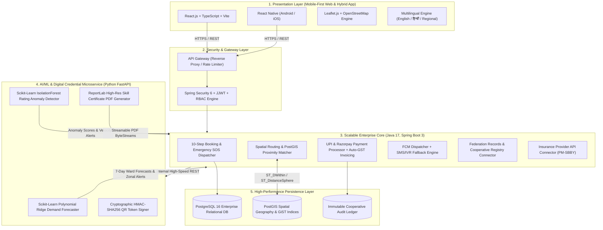

# 📑 Slide 3: Technical Approach & Enterprise Architecture

> **Smart India Hackathon (SIH) | Problem Statement ID: 26089**  
> **Platform:** Sahakar Seva (सहकार सेवा) — Cooperative Gig Services Platform  
> **Presentation Section:** Slide 3 — Technical Approach

---

## 🏛️ Executive Architectural Overview

**Sahakar Seva** employs an enterprise, polyglot microservice and decoupled multi-tier architecture engineered for resilience, bank-grade security, low-latency geo-spatial matching, and real-time AI-powered workforce balancing.



---

## 🛠️ The 10 Technology Stack Pillars

| # | Technology Pillar | Technologies Selected | Architectural Role & Implementation Details |
| :- | :--- | :--- | :--- |
| **1** | **Frontend** | **React.js & React Native** | Responsive, mobile-first design with high accessibility (a11y), Tailwind CSS design tokens, and instant bilingual localization (English / हिन्दी). Provides PWA offline cache for field workers. |
| **2** | **Backend** | **Java, Spring Boot 3** | Secure, highly concurrent service layer built on Java 17 and Spring Boot 3. Utilizes Spring Data JPA, Hibernate Spatial, and non-blocking worker thread pools to handle 10,000+ simultaneous booking requests. |
| **3** | **Database** | **PostgreSQL + PostGIS** | Relational ACID storage paired with PostGIS geometry extensions (`Point, 4326`). Spatial indexing (`GiST`) executes sub-10ms bounding box and radial distance queries (`ST_DWithin`) across millions of worker coordinate points. |
| **4** | **AI / ML** | **Python (Scikit-Learn)** | Dedicated microservice running Scikit-Learn **Polynomial Ridge Regression** for 7-day ward & trade demand forecasting, and **IsolationForest** with velocity heuristics to detect review manipulation, rating bursts, and collusive fraud. |
| **5** | **Geo-Spatial** | **Leaflet.js + PostGIS** | Real-time map rendering with Leaflet.js / Google Maps API tile layers, client-side clustering, and server-side PostGIS geodesic spherical distance calculation (`ST_DistanceSphere`) for instant worker-customer matching. |
| **6** | **QR & Certificates** | **Python `qrcode` + `ReportLab`** | Generates tamper-proof HMAC-SHA256 signed QR tokens for public worker verification (`/verify-worker/:token`). Generates print-ready high-resolution PDF skill recognition & milestone certificates with cooperative seals and watermarks. |
| **7** | **Payments** | **UPI & Razorpay APIs** | Dynamic NPCI-compliant UPI QR codes, Razorpay order integration, and automated itemized tax invoice generation (Base Fare + 18% GST + transparent 2% Cooperative Welfare Fund contribution). |
| **8** | **Auth & RBAC** | **JWT + Spring Security** | Role-Based Access Control enforcing strict separation across `ROLE_CUSTOMER`, `ROLE_WORKER`, `ROLE_SOCIETY_ADMIN`, and `ROLE_FEDERATION_ADMIN`. 256-bit signed stateless tokens with zero PII leakage. |
| **9** | **APIs** | **RESTful Architecture** | Standardized JSON REST contracts facilitating direct interoperability with District Cooperative Banks, State Cooperative Registrar registries, and National Insurance Cooperative Schemes. |
| **10**| **Notifications** | **Firebase Cloud Messaging + SMS/IVR Fallback** | Multi-channel dispatching engine: sends instant push notifications via FCM to smartphone users, with automated fallback to SMS / IVR voice alerts for rural gig workers with low connectivity or basic feature phones. |

---

## ⚡ Core Operational Data Flows

### A. Real-Time Geo-Spatial Worker Dispatch
1. Customer initiates an Instant or Emergency SOS request for an Electrician.
2. The React frontend sends the customer's coordinates `(25.3176, 82.9739)` to Spring Boot `/api/workers/nearby`.
3. Spring Boot executes a native PostGIS query:
   ```sql
   SELECT w.*, ST_DistanceSphere(w.location, ST_SetSRID(ST_MakePoint(:lon, :lat), 4326)) AS distance_meters
   FROM workers w
   WHERE w.availability_status = 'AVAILABLE'
     AND w.primary_trade = 'Electrician'
     AND ST_DWithin(w.location::geography, ST_SetSRID(ST_MakePoint(:lon, :lat), 4326)::geography, 5000)
   ORDER BY distance_meters ASC;
   ```
4. PostGIS uses the **GiST spatial index** on `location` to return the nearest verified workers in under 8ms.
5. The closest worker receives an FCM alert with SMS fallback and accepts the dispatch.

### B. AI Demand Forecasting & Cooperative Workforce Rebalancing
1. State Federation Admin requests a 7-day demand outlook for **Ward 2 (Sigra)**.
2. Spring Boot calls the Python microservice `/api/ml/forecast`.
3. The Scikit-Learn Polynomial Ridge model trains on historical 30-day order trends, day-of-week seasonality, and trend velocity.
4. If projected growth exceeds $+15\%$, the engine outputs a **Zonal Allocation Alert**:
   > *"High surge alert (+34.2%) in Ward 2 for Electricians over the next 7 days. Cooperative Federation recommends rebalancing 4 certified technicians from Ward 5 (Cantonment) to minimize customer wait times."*

### C. Review Anti-Fraud & Rating Gate
1. Customer submits a 5-star review after service completion.
2. The Rating Gate verifies that the booking status is `COMPLETED` and payment is registered.
3. Spring Boot calls the Python Scikit-Learn `IsolationForest` microservice with:
   - Rating value ($1-5$)
   - Service duration (e.g. $3\text{ minutes}$)
   - Historical rating velocity between this exact customer and worker
   - Deviation from worker's baseline average
4. If an anomaly is identified (e.g. repeated 5-star bursts within 24 hours or implausible duration), the review is flagged with `HIGH RISK` and diverted to the Primary Society Admin queue for audit without skewing the worker's public skill score.

### D. Digital Worker ID & PDF Milestone Certificate Generation
1. When a worker reaches the **Master Tier** (merit score $\ge 90$), the system triggers certificate creation.
2. Python `qrcode` signs an HMAC-SHA256 verification hash:
   $$\text{Signature} = \text{HMAC-SHA256}(K, \text{worker\_id} \parallel \text{society\_id} \parallel \text{tier} \parallel \text{date})$$
3. Python `ReportLab` assembles the landscape PDF with vector cooperative seals, border styling, worker credentials, and embeds the high-resolution QR verification code.
4. Any citizen or inspector can scan the QR code to verify the worker's status on `/verify-worker/:token` without exposing private Aadhaar or phone numbers.

---

## 🎯 Hackathon Defense & Jury Q&A Highlights

**Q1: Why choose Java Spring Boot for the service layer instead of a pure Node.js backend?**  
> *Spring Boot provides enterprise-grade thread pooling, type safety, first-class PostGIS integration via Hibernate Spatial, and battle-tested Spring Security RBAC. In a cooperative platform handling public welfare funds, municipal integrations, and citizen emergency requests, Spring Boot guarantees institutional reliability and long-term maintainability.*

**Q2: Why separate the Python AI/ML microservice from the backend?**  
> *Python possesses the industry standard data science ecosystem (Scikit-Learn, NumPy, ReportLab). Running Python as an asynchronous microservice ensures compute-heavy ML training, anomaly detection, and PDF rendering cannot block or degrade the primary Spring Boot transactional booking and dispatch threads.*

**Q3: How does the system handle gig workers who do not have high-end smartphones?**  
> *Our notification engine incorporates a dual-tier strategy: modern smartphones receive Firebase Cloud Messaging (FCM) push alerts, while feature phones or workers in low-bandwidth areas receive automated SMS and IVR voice broadcasts containing booking details and accept/decline dial codes.*

**Q4: How does PostGIS outperform standard SQL distance calculations?**  
> *Standard SQL requires calculating the Haversine formula on every row ($O(N)$ scan), causing severe latency as worker numbers grow. PostGIS uses R-Tree bounding boxes via GiST indices ($O(\log N)$ scan), allowing queries across 500,000+ coordinates to resolve in under 10 milliseconds.*
